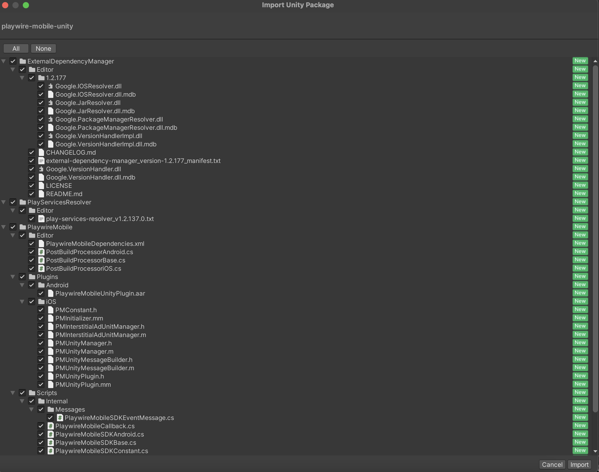
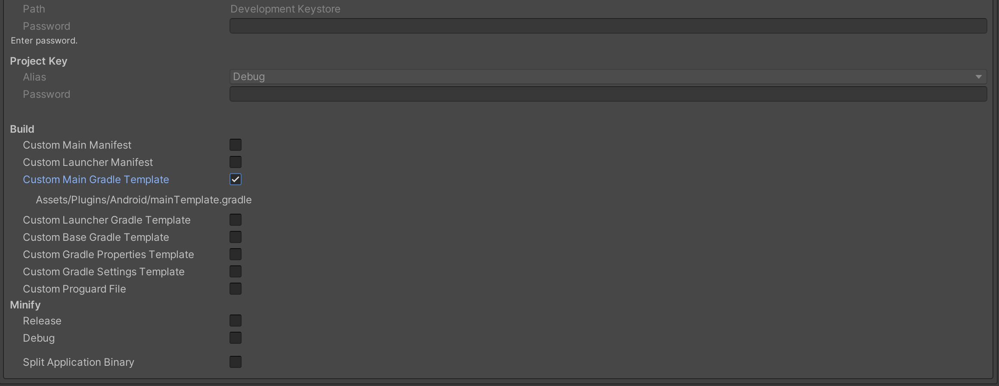
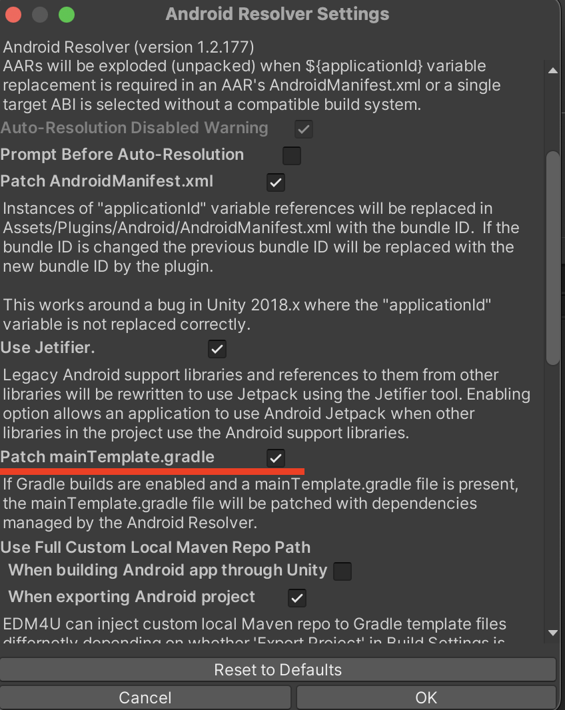

<H1 align="center">PlaywireMobile Unity SDK</H1>

<p align="center">
    <a></a>
    <a href="https://unity.com/"></a>
</p>

---

# Requirements

- Unity 2022.3.16f1+ (LTS)
- iOS 12.4+
- Android 7.1+ (API 25+)
- JAVA 11

# Installation

Follow these steps to import the `PlaywireMobile Unity SDK` to your project:

1. Download the latest `PlaywireMobile Unity SDK` package [here](https://github.com/intergi/playwire-mobile-unity-package).
2. Open the Unity Editor, go to `Assets > Import Package > Custom Package`.
3. In the Import Unity Package window, keep all the files selected, then click `Import`.

4. Once importing has been finished, the set of dependencies should be resolved. Follow the [Dependencies installation](#dependencies-installation) section to resolve all required dependencies.
5. Search for the initialization metadata (`publisherId` and `appId`) emailed by your Playwire Account Manager.
6. Build and run your Unity project.

# Dependencies installation

The `PlaywireMobile Unity SDK` is configured to use the [External Dependency Manager](https://github.com/googlesamples/unity-jar-resolver) (formerly Play Services Resolver/Jar Resolver). This is a complex tool for managing and automating dependencies for iOS (CocoaPods) and Android (Gradle).

See the list of options to resolve and adjust settings in `Assets > External Dependency Manager`. If it is not available for you, go to `File > Build settings > Select iOS or Android > Switch Platform`.

> **Note**: If you are integrating an updated version of the `PlaywireMobile Unity SDK` on top of existing one, you may face an issue while building iOS project's workspace. The thing is Unity fails to download newest podspecs from remote repository to your local repository (`Users/<USER_NAME>/.cocoapods/repo`) while building iOS project. Thus you need to do it by yourselves just by running command to actualize local `Playwire iOS` pods. By default pod repo's name is `intergi` and to update latest podspecs, please run the next command in Terminal.

```bash
$ pod repo update intergi
```
## iOS

The External Dependency Manager uses [CocoaPods](https://guides.cocoapods.org/using/getting-started.html#getting-started) to install the iOS dependencies.

All dependencies are resolved automatically during the build process. The build scripts run specified pod commands to install dependencies and configure an iOS project according to the settings. You can check and adjust resolver settings in `Assets > External Dependency Manager > iOS Resolver > Settings`.

## Android

The External Dependency Manager uses [Gradle](https://docs.gradle.org/current/userguide/getting_started.html) to install the Android dependencies.

To resolve required dependencies for Android you should follow next steps:

1. Go to `Edit > Project Settings > Player > Settings for Android > Publishing Settings` and check `Custom Main Gradle Template`.   

    

2. Go to `Assets > External Dependency Manager > Android Resolver > Settings`, and verify that `Patch mainTemplate.gradle` is enabled.
    
    

3. When done, go to `Assets > External Dependency Manager > Android Resolver`, and click `Force Resolve` to start the automatic dependency resolving.

# Usage
## Initialization

Initialize the PlaywireMobile Unity SDK in your app’s [`Start()`](https://docs.unity3d.com/ScriptReference/MonoBehaviour.Start.html) method.

```csharp
string publisherId = "YOUR_PUBLISHER_ID";
string appId;

#if UNITY_ANDROID
    appId = "YOUR_ANDROID_APP_ID";
#elif UNITY_IOS
    appId = "YOUR_IOS_APP_ID";
#else
    Debug.LogWarning("Unsupported platform.");
    return;
#endif

PlaywireMobileSDK.InitializeSDK(publisherId, appId);
```

> **Note**: A configuration file metadata such as `YOUR_PUBLISHER_ID` and `YOUR_APP_ID` must be provided by your Playwire Account Manager.

When done, you will receive the `PlaywireMobileSDKListener.OnSDKInitializedEvent`.

> **Note**: If you call any method without initialization, the SDK notifies you about it in the IDE logs window.

## Request for ads

### Request for interstitial ads

To display an interstitial ad on your app, you must first request it and provide the ad unit.

When requesting  an interstitial ad, we recommend that you do so in advance before planning to present it to your user as the loading process may take time.

```csharp
string InterstitialAdUnitId = "Interstitial";
PlaywireMobileSDK.LoadInterstitial(InterstitialAdUnitId);
```

> **Note**: An interstitial ad is a one-time-use object, which means it must be loaded again after its shown. Use the `PlaywireMobileSDK.IsInterstitialReady(string adUnitId)` method to check if the ad is ready to be presented.

If the interstitial is loaded successfully, you would receive `PlaywireMobileSDKListener.Interstitial.OnLoadedEvent`. If not, you would receive `PlaywireMobileSDKListener.Interstitial.OnFailedToLoadEvent`.
In case the interstitial is ready to be displayed, you can present full screen content.

```csharp
string InterstitialAdUnitId = "Interstitial";
PlaywireMobileSDK.ShowInterstitial(InterstitialAdUnitId);
```

`PlaywireMobileSDKListener.Interstitial` provides interstitial-related callbacks to inform you about an interstitial ad lifecycle. You can subscribe to be notified about events and how to handle them.

```csharp
void OnEnable () 
{
    // ...
    PlaywireMobileSDKListener.Interstitial.OnLoadedEvent += OnInterstitialLoadedEvent;
    PlaywireMobileSDKListener.Interstitial.OnFailedToLoadEvent += OnInterstitialFailedToLoadEvent;
    // ...
}

void OnInterstitialLoadedEvent(PlaywireMobileSDKEventArgs args) 
{
    // ...
    bool isInterstitialReady = PlaywireMobileSDK.IsInterstitialReady(args.AdUnitId);

    if (!isInterstitialReady) {
        // Load interstitial again or show error.
        return;
    }
    PlaywireMobileSDK.ShowInterstitial(args.AdUnitId);
    // ...
}

void OnInterstitialFailedToLoadEvent(PlaywireMobileSDKEventArgs args) 
{
    // ...
}
```

See the list below for interstitial-related callbacks.

```csharp
... PlaywireMobileSDKListener {
    ... Interstitial {
        /// It is fired when the interstitial ad successfully loaded full screen content and ready to be presented.
        public static event Action<PlaywireMobileSDKEventArgs> OnLoadedEvent

        /// It is fired when the interstitial ad failed to load full screen content.
        public static event Action<PlaywireMobileSDKEventArgs> OnFailedToLoadEvent

        /// It is fired when an interstitial ad dismissed full screen content and the user goes back to the application screen.
        public static event Action<PlaywireMobileSDKEventArgs> OnClosedEvent
    }
}
```

### Logger

To start monitoring events inside the `PlaywireMobile Unity SDK` use logger to log events to the IDE console. The logs can contain information about event's name, ad unit parameters, ad server response, etc.

```csharp
PlaywireMobileSDK.StartConsoleLogger();
```